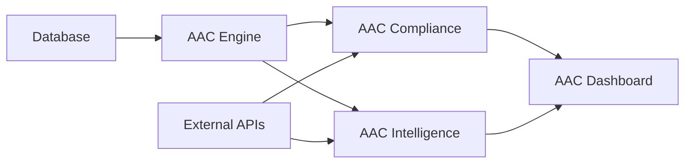

# ARCHITECTURE.md

## Executive Summary

The AAC (Automated Accounting and Compliance) system is designed to provide an integrated platform for managing accounting records, ensuring compliance, and offering intelligent insights through a streamlined dashboard. It is tailored for Resonance Energy's operational needs, as evidenced by customized files and libraries within the repository. This document aims to delineate the architecture of the AAC system, highlighting its core components, their interactions, and supporting infrastructure.

The AAC repository comprises multiple Python scripts that encapsulate the system's core functionalities. The primary goal is to automate daily accounting processes while ensuring adherence to compliance regulations. The system also possesses the capability to generate insightful reports by leveraging existing data for strategic business intelligence. The robust design accommodates current requirements while remaining adaptable for future expansion, catering to evolving economic and regulatory contexts.

## System Overview

The AAC system is structured into several core components that handle various aspects of accounting and compliance tasks. Here is a high-level ASCII diagram illustrating the system's primary modules and their interconnections:

```
+------------------------------------------------+
|                    AAC System                  |
|     +------------------+     +---------------+ |
|     | Accounting DB    |<--->| AAC Engine    | |
|     +------------------+     +---------------+ |
|        ^       |                   |           |
|        |       v                   v           |
|     +------------------+     +---------------+ |
|     | AAC Compliance   |<--->| AAC Intelligence| |
|     +------------------+     +---------------+ |
|        ^                                 |     |
|        |                                 v     |
|     +------------------+     +----------------+|
|     | AAC Dashboard    |     | External APIs  ||
|     +------------------+     +----------------+|
+------------------------------------------------+
```

## Component Breakdown

1. **AAC Engine**: The central processing unit of the system. It connects all other components, coordinating tasks and triggering functions as needed. Responsible for the core logic implementation and integration with the accounting database.

2. **AAC Compliance**: Manages compliance-related functionalities, ensuring that all operations adhere to current regulatory standards. It processes data from the accounting database to verify compliance issues.

3. **AAC Intelligence**: Provides data analytics and insights, transforming raw data into actionable intelligence. It supports strategic decision-making by offering predictive analyses and statistical reports.

4. **AAC Dashboard**: The user interface component that connects end-users with the system's functionalities. It shows real-time data and analytics intuitively, facilitating easier decision-making processes.

5. **Accounting Database (aac_accounting.db)**: A database file that holds all accounting records which other components use to perform their functions.

## Data Flow Description

Data initially enters the system via the Accounting Database, where raw financial records and transaction logs are stored. The AAC Engine accesses these records and processes them through the AAC Compliance module for regulatory checks. The AAC Intelligence module then analyzes the processed data, generating insights and reports. The dashboard component provides a visual interface for users to interact with and view the insights and compliance status.

```
Database -> Engine -> Compliance
                    -> Intelligence
Engine -> Dashboard -> End Users
```

## Dependencies

### Internal Dependencies
- Various Python scripts within the module interact with each other like `aac_compliance.py`, `aac_engine.py`, etc.
- Internal data passing through system components such as compliance checks and intelligence insights.

### External Dependencies
- External APIs for additional data sources and verification.
- Python libraries (listed in `requirements.txt`) to handle data processing, analytics, and system integrations.

## Component Relationships



## Deployment Architecture

The AAC system is deployed as a set of interconnected Python scripts running on a centralized server. The Accounting Database is managed as a single, centralized database instance. The deployment leverages Python virtual environments, ensuring all dependencies are accurately managed. Additionally, it is configured to exploit cloud services for scalability, given the availability of future expansions.

## Security Considerations

- **Data Encryption**: Ensure all sensitive data is encrypted in transit and at rest.
- **User Authentication**: Implement robust authentication mechanisms to validate user access.
- **Audit Logging**: Maintain logs of all operations for audit purposes.
- **Regular Updates**: Continuously update dependencies to mitigate vulnerabilities.

## Performance Characteristics

The system is optimized for real-time processing and low-latency responses. The choice of Python ensures rapid execution of complex algorithms, while the modular structure facilitates load distribution. Scalability is planned for high-volume transactional data via efficient data handling in database operations.

## Future Roadmap Considerations

- **Cloud Integration**: Expand capabilities for cloud storage and processing.
- **Machine Learning Models**: Incorporate machine learning for predictive analytics and anomaly detection.
- **API Expansions**: Broaden API integrations for additional data sources and services.
- **User Customization**: Enhance the dashboard with user customization features, allowing more dynamic reporting.

By adhering to these structured components and design principles, the AAC system offers a comprehensive and adaptable tool for accounting and compliance management in a dynamic business environment.