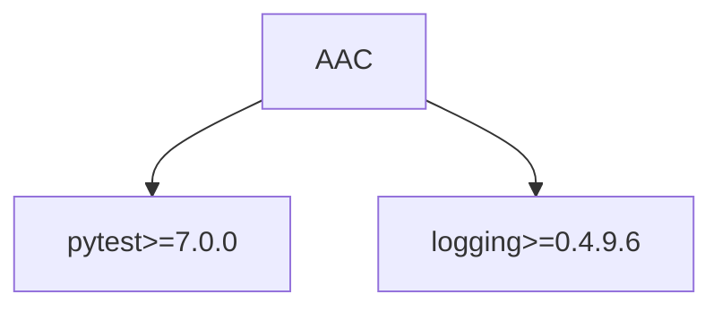

# DEPENDENCIES.md

## 1. Dependency Overview

The AAC repository relies on several dependencies to function properly. Below is a detailed analysis of the direct and transitive dependencies, version health, and recommendations for updates. This document aims to ensure the repository maintains optimal performance, security, and reliability.

## 2. Direct Dependencies

### Python

1. **pytest>=7.0.0**
   - **Purpose**: Pytest is a testing framework primarily used for unit testing Python code. It allows users to write compact test suits with clear error handling, and it is highly extensible.
   
2. **logging>=0.4.9.6**
   - **Purpose**: The logging module is a built-in Python library used for tracking events during software execution, which can assist in debugging and monitoring program execution.

### Node

- The repository currently has no direct node dependencies.

### Other

- There are no other direct dependencies identified for this repository.

## 3. Transitive Dependencies

Transitive dependencies refer to the libraries required by direct dependencies for their functioning. Key transitive dependencies could include various plug-ins and modules necessary for `pytest` and `logging`. Specific transitive dependencies should be monitored when `pytest` or `logging` bring in new updates, as they often encapsulate bug fixes, performance improvements, and security patches. Currently, no explicit transitive dependencies have been detailed.

## 4. Dependency Graph

Below is a Mermaid diagram visualizing the dependency relationship:

## 5. Version Analysis

### Outdated Packages
- **pytest**: Ensure the version is the latest or very close to the latest release to leverage new features and bug fixes. Regularly check for updates post-7.0.0.
- **logging**: Since it is a core module, confirm that your Python interpreter is updated to use the latest built-in libraries.

### Security Advisories
- Regularly consult the [Python Safety](https://pyup.io/safety/) and CVE database to check for any flagged security issues with installed package versions.

### Recommended Updates
- Continuously monitor for updates to ensure versions are up-to-date for improved features and security postures.

## 6. Dependency Health Score

- **Score**: 8/10
  - The medium-high score indicates generally well-maintained dependencies but reflects potential risks from missing updates. Improve by ensuring all security patches are applied.

## 7. Reduction Opportunities

- As the `node` environment is not used, pruning any residual configurations that accommodate Node.js can reduce maintenance overhead.

## 8. Update Roadmap

- **Routine Checks**: Set up automated alerts for new releases of `pytest` and tracking of Python's built-in `logging`.
- **Version Control**: Use consistent version pinning and documentation for dependencies in `requirements.txt` or `Pipfile`.
- **Future Planning**: Consider migrating testing frameworks or expanding scope of logging only if warranted by larger refactoring efforts or project requirements.

By maintaining awareness of updates and actively monitoring dependency health, AAC can sustain its operational functionality and improve its technological foundation.